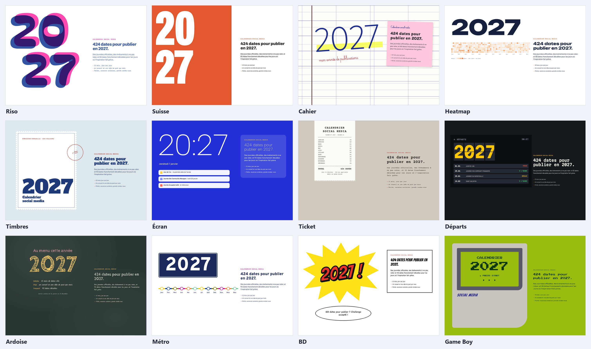
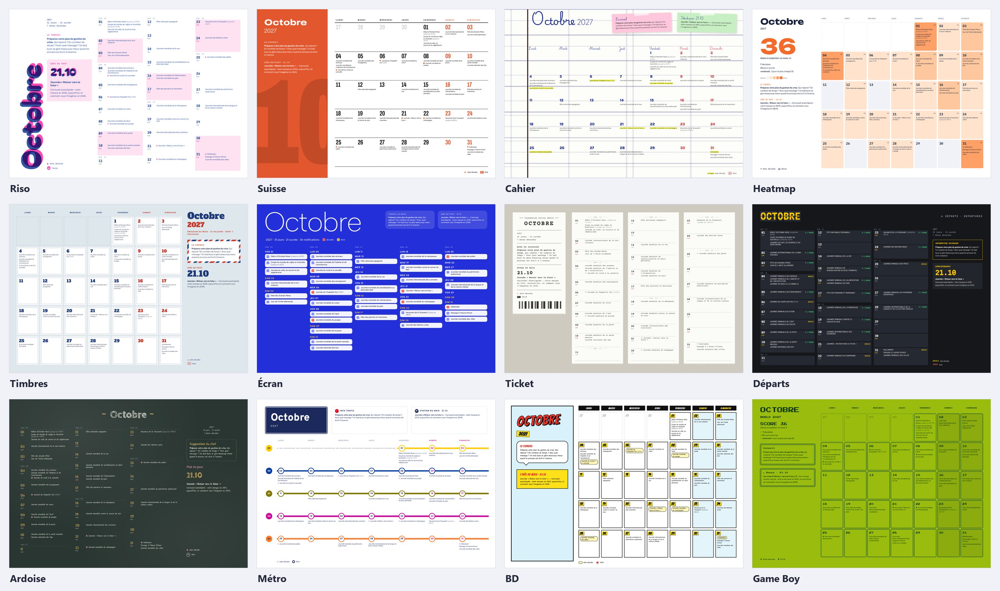
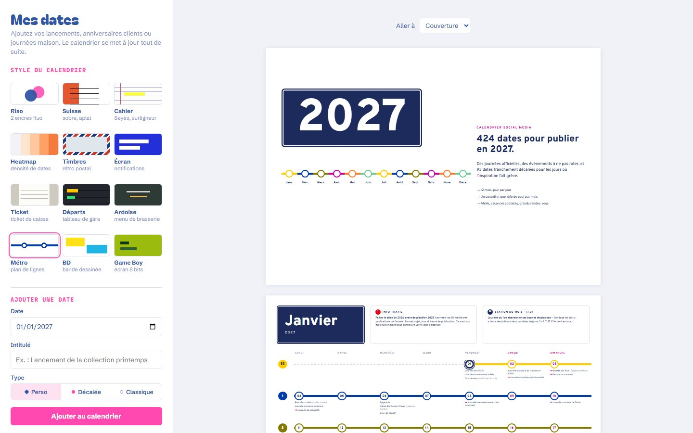

<div align="center">

# Calendrier social media 2027

**424 dates pour ne plus jamais se demander quoi publier.**<br>
Choisissez un style parmi 12, ajoutez vos propres dates, exportez un PDF prêt à imprimer.

### [→ Ouvrir le générateur](https://calendrier-social-media-2027.vercel.app)



</div>

---

## Ce qu'il y a dedans

- **424 dates** jour par jour : journées mondiales, fêtes, jours fériés, soldes, vacances scolaires et les grands rendez-vous de l'année (présidentielle, 80e Festival de Cannes, Coupe du monde de rugby, éclipse totale du 2 août…).
- **93 dates décalées**, repérables d'un coup d'œil, pour les jours où l'inspiration fait grève : journée du papier bulle, Towel Day, journée « Promenez vos plantes vertes », Festivus…
- **Un conseil de community manager et une idée de post par mois**, tirée d'une date décalée.
  > *Journée « Promenez vos plantes vertes » : baladez la plante du bureau et filmez-la façon documentaire animalier. Absurde, donc partagé.*
- **Une page récap** : jours fériés, vacances scolaires par zone, changements d'heure, saisons et grands événements.
- **Vos propres dates** (lancements, anniversaires clients, journées maison) et votre nom sur la couverture.
- **Un PDF de 15 pages en A4 paysage** : couverture, 12 mois, récap, dos.

## 12 styles, un même contenu

Chaque style s'inspire d'un objet réel et adapte toute la mise en page, pas seulement les couleurs.



| Style | L'idée | Lien direct |
|---|---|---|
| **Riso** | Fanzine imprimé en risographie : deux encres fluo qui se chevauchent, jours en éphéméride | [`?style=riso`](https://calendrier-social-media-2027.vercel.app/?style=riso) |
| **Suisse** | Sobre : un aplat de couleur par mois et le numéro du mois en filigrane | [`?style=suisse`](https://calendrier-social-media-2027.vercel.app/?style=suisse) |
| **Cahier** | Papier à grands carreaux Seyès, surligneur fluo, post-it scotchés | [`?style=cahier`](https://calendrier-social-media-2027.vercel.app/?style=cahier) |
| **Heatmap** | Chaque case est colorée selon le nombre d'occasions de publier | [`?style=heatmap`](https://calendrier-social-media-2027.vercel.app/?style=heatmap) |
| **Timbres** | Chaque jour est un timbre dentelé, les fériés reçoivent un cachet de la poste | [`?style=timbres`](https://calendrier-social-media-2027.vercel.app/?style=timbres) |
| **Écran** | Le mois comme un flux de notifications, « 20:27 » en guise d'heure | [`?style=ecran`](https://calendrier-social-media-2027.vercel.app/?style=ecran) |
| **Ticket** | Ticket de caisse thermique, code-barres et « TOTAL 424 DATES » | [`?style=ticket`](https://calendrier-social-media-2027.vercel.app/?style=ticket) |
| **Départs** | Tableau des départs de gare : chaque jour est « À L'HEURE », « DÉCALÉ » ou « FÉRIÉ » | [`?style=departs`](https://calendrier-social-media-2027.vercel.app/?style=departs) |
| **Ardoise** | Menu de brasserie à la craie : suggestion du chef et plat du jour | [`?style=ardoise`](https://calendrier-social-media-2027.vercel.app/?style=ardoise) |
| **Métro** | Chaque semaine est une ligne, chaque jour une station, les fériés des correspondances | [`?style=metro`](https://calendrier-social-media-2027.vercel.app/?style=metro) |
| **BD** | Cases de bande dessinée, bulles et « FÉRIÉ ! » en onomatopée | [`?style=bd`](https://calendrier-social-media-2027.vercel.app/?style=bd) |
| **Game Boy** | Écran 8 bits à quatre teintes de vert, score et bonus | [`?style=gameboy`](https://calendrier-social-media-2027.vercel.app/?style=gameboy) |

## Comment ça marche



1. **Choisissez un style** : l'aperçu se met à jour instantanément.
2. **Ajoutez vos dates** avec un type : *perso* (◆), *décalée* (●) ou *classique*. Si un mois devient très chargé, le texte se resserre tout seul pour tenir dans la page.
3. **Téléchargez le PDF** : dans la fenêtre d'impression, choisissez *Enregistrer au format PDF* et cochez *Graphiques d'arrière-plan*.

Rien à installer, pas de compte. Vos dates restent **dans votre navigateur** : elles ne sont envoyées nulle part. Le bouton *Sauvegarder mes dates* les exporte en `.json` pour les retrouver sur un autre appareil.

## Sous le capot

Le site tient en **un seul fichier HTML statique** : pas de framework, pas de serveur, pas de dépendance à installer. Seules les polices viennent de Google Fonts.

```
index.html            ← le générateur, généré puis déployé tel quel
src/
├── data.py           ← les 424 dates, les conseils et les idées de post
├── app.html          ← l'interface et le rendu des pages (JavaScript)
├── build.py          ← assemble le tout dans index.html
└── themes/
    ├── _polices.css  ← polices Google Fonts
    ├── _base.css     ← format A4 paysage, remise à zéro
    ├── _commun.css   ← ce que partagent les styles
    └── riso.css, suisse.css, … gameboy.css   ← un fichier par style
docs/                 ← les images de ce README
```

Après toute modification dans `src/`, régénérez le site :

```bash
python src/build.py
```

Chaque push sur `main` est déployé automatiquement sur Vercel.

### Ajouter ou corriger une date

Tout se passe dans `src/data.py` :

```python
ev(3, 14, "Cérémonie des Oscars", "Journée de Pi (π)")
```

Quelques conventions dans les intitulés :

| Syntaxe | Effet |
|---|---|
| `(…)` | précision affichée plus discrètement, par exemple `(jusqu'au 22/05)` |
| `(férié)` | fait du jour un jour férié |
| `*` | date à confirmer, signalée dans la légende du mois |
| `~` en préfixe | date décalée |

Les dates qui changent chaque année (Pâques, fête des Mères, Black Friday…) sont calculées avec `nth()`, et des contrôles au build vérifient qu'elles tombent au bon jour.

### Créer un style

1. Créez `src/themes/monstyle.css`, en partant du style le plus proche.
2. Ajoutez `"monstyle"` à la liste `STYLES` de `src/build.py`.
3. Déclarez-le dans le tableau `THEMES` de `src/app.html` (nom, description, vignette). Si besoin, précisez aussi sa mise en page dans `LAYOUT` (liste, grille ou notifications) et ses libellés dans `LABELS`.

## Sources

- **Vacances scolaires 2026-2027**, rentrée et Toussaint 2027 : calendrier officiel du ministère de l'Éducation nationale.
- **Présidentielle** (18 avril et 2 mai 2027) : dates fixées en Conseil des ministres le 30 juin 2026.
- **Grands événements** (Oscars, Grammy Awards, Super Bowl, Cannes, Eurovision, Ligue des champions, Coupes du monde, Tour de France…) : dates annoncées par les organisateurs, vérifiées en septembre 2026.
- Les dates encore incertaines (Ramadan, Roland-Garros, Marathon de Paris…) sont **marquées d'un astérisque** dans le calendrier.
- Beaucoup de journées décalées viennent de la culture américaine ou d'internet : vérifiez qu'elles parlent à votre audience avant de publier.
